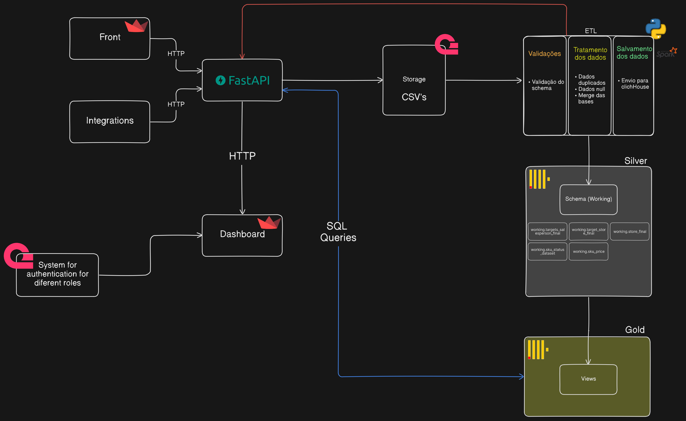
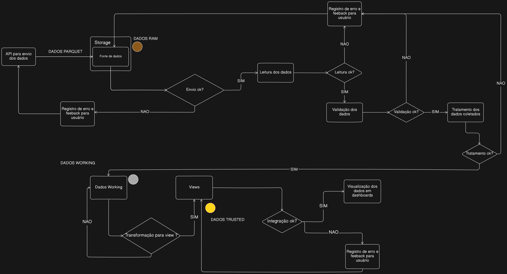

# Arquitetura de Projeto

## Índice
- [Introdução](#introdução)
- [Requisitos/Histórias de Usuários](#requisitoshistórias-de-usuários)
  - [Requisitos Funcionais](#requisitos-funcionais)
  - [Requisitos Não Funcionais](#requisitos-não-funcionais)
  - [Histórias de Usuários](#histórias-de-usuários)
- [Arquitetura do Sistema](#arquitetura-do-sistema)
  - [Visão Geral](#visão-geral)
    - [Arquitetura de Fluxo e Processos](#arquitetura-de-fluxo-e-processos)
  - [Modelagem dos Dados](#modelagem-dos-dados)
    - [Schemas](#schemas)
    - [Views](#views)
  - [Monitoramento e Gerenciamento](#monitoramento-e-gerenciamento)
    - [Pontos Identificados de Monitoramento e Gerenciamento](#pontos-identificados-de-monitoramento-e-gerenciamento)
    - [Considerações Estratégicas](#considerações-estratégicas)
    - [Proposta Detalhada de Monitoramento e Gerenciamento](#proposta-detalhada-de-monitoramento-e-gerenciamento)
  - [Integridade de Dados](#integridade-de-dados)
- [Lista de Tecnologias](#lista-de-tecnologias)
- [Segurança](#segurança)
  - [Pontos Identificados](#pontos-identificados)
  - [Considerações Estratégicas](#considerações-estratégicas)
  - [Planos de Ação](#planos-de-ação)
- [Escalabilidade](#escalabilidade)
- [Auditoria e Conformidade](#auditoria-e-conformidade)
- [Design Visual](#design-visual)
  - [Princípios de Design Utilizados](#princípios-de-design-utilizados)
  - [Hierarquia de Visualização dos Dados](#hierarquia-de-visualização-dos-dados)
  - [Padrões de Design Utilizados](#padrões-de-design-utilizados)
  - [Wireframe](#wireframe)
- [Testes](#testes)
  - [Identificação de Testes Necessários](#identificação-de-testes-necessários)
  - [Execução e Documentação de Testes](#execução-e-documentação-de-testes)
- [Dashboard Versão 1](#dashboard-versão-1)

## Introdução
Este documento de arquitetura fornece uma estrutura abrangente para o desenvolvimento técnico do projeto, alinhando-se aos padrões TOGAF para garantir orientação sistemática e comunicação eficiente em todas as fases do projeto.

## Requisitos/Histórias de Usuários

### Requisitos Funcionais
Especificações detalhadas das funcionalidades do sistema, incluindo:
- **RF001**: O sistema vai enviar notificação para os usuários com as melhores sugestões de vendas diariamente.
- **RF002**: O sistema deve mostrar os produtos com maiores margens para os vendedores.
- **RF003**: O sistema deve atualizar diariamente as informações mostradas aos usuários.
- **RF004**: O sistema deve diferenciar os cargos do usuário (hierarquia de acesso).
- **RF005**: O sistema deve rankear desempenho entre lojas.
- **RF006**: O sistema deve gerar recomendações de quais produtos são frequentemente vendidos juntos.
- **RF007**: O colaborador (gerentes e vendedores) deve ser capaz de simular a remuneração mensal dele.
- **RF008**: O sistema deve recomendar os produtos que possuem maior margem de lucro.
- **RF009**: O sistema deve permitir que os vendedores visualizem metas de vendas diárias, semanais e mensais.
- **RF010**: O sistema deve fornecer gráficos e dashboards personalizados para visualização de dados de vendas.

### Requisitos Não Funcionais
Critérios de qualidade como desempenho, segurança e usabilidade:
- **RNF001**: A linguagem da interface deve ser de fácil entendimento para o usuário.
- **RNF002**: O sistema deve criptografar dados sensíveis no momento de ETL.
- **RNF003**: O sistema deve ser escalável para conseguir tratar alta quantidade de dados.
- **RNF004**: O sistema deve ter uma rastreabilidade de erros em relação aos serviços externos da aplicação.
- **RNF005**: O sistema deve permitir que as atualizações e manutenções sejam realizadas com zero ou mínimo impacto na experiência do usuário.
- **RNF006**: O sistema deve ser modular, facilitando futuras expansões e personalizações sem a necessidade de grandes retrabalhos.
- **RNF007**: O sistema deve ser compatível com dispositivos móveis, oferecendo uma experiência de usuário consistente em smartphones e tablets.
- **RNF008**: O sistema deve garantir a integridade dos dados em caso de falha do sistema.
- **RNF009**: O sistema deve ser completamente escrito e apresentado em português, incluindo todas as interfaces de usuário, mensagens de erro, documentação e relatórios, para garantir acessibilidade e compreensão para todos os usuários.

### Histórias de Usuários
Narrativas das interações dos usuários com o sistema para alcançar objetivos específicos:
- **US001**: Como **vendedor**, quero ver uma lista dos produtos com as maiores margens de lucro, para que eu possa priorizar a venda desses produtos e aumentar minha comissão. (RF002)
- **US002**: Como **vendedor**, quero que os produtos com maiores margens sejam destacados visualmente no app, para que eu possa identificá-los rapidamente entre outros produtos. (RF002)
- **US003**: Como **usuário**, quero ver a data e a hora da última atualização das informações no app, para que eu possa confiar na atualidade dos dados que estou consultando. (RF003)
- **US004**: Como **gerente**, quero acessar relatórios de desempenho da equipe de vendas e dados agregados, para que eu possa monitorar e gerenciar a performance dos vendedores sob minha supervisão. (RF004)
- **US005**: Como **diretor**, quero ter acesso ao desempenho das filiais regionais da qual eu sou responsável, para que eu possa traçar planos e estratégias a partir disso. (RF004)
- **US006**: Como **diretor**, quero visualizar um ranking das filiais com base em seu desempenho, para que eu possa identificar quais filiais estão se destacando e quais precisam de melhorias. (RF005)
- **US007**: Como **vendedor**, quero visualizar combos ou pacotes sugeridos de produtos que costumam ser vendidos juntos, para que eu possa oferecer essas opções de forma mais eficiente aos clientes. (RF006)
- **US008**: Como **gerente**, quero acessar relatórios detalhados mostrando quais produtos são frequentemente comprados juntos, para que eu possa ajustar nossas estratégias de estoque e marketing com base em tendências de compra. (RF006)
- **US009**: Como **vendedor**, quero simular minha remuneração mensal com base nas vendas realizadas e nas metas atingidas, para que eu possa entender quanto vou ganhar e planejar minhas atividades para maximizar meu rendimento. (RF007)
- **US010**: Como **usuário**, quero que o sistema utilize uma linguagem natural e familiar ao invés de jargões técnicos, para que eu possa compreender facilmente as instruções e mensagens exibidas. (RNF001)
- **US011**: Como **vendedor**, quero visualizar uma lista de produtos com as maiores margens de lucro, para que eu possa priorizar a venda desses itens e aumentar minha comissão. (RF008)
- **US012**: Como **responsável pela conformidade**, quero que a criptografia aplicada durante o ETL esteja em conformidade com os padrões de segurança (como GDPR ou HIPAA), para que a empresa evite riscos legais e financeiros. (RNF002)
- **US013**: Como **administrador de dados**, quero que os dados sensíveis sejam criptografados automaticamente durante o processo de ETL, para que as informações confidenciais estejam protegidas contra acessos não autorizados enquanto são movidas e transformadas. (RNF002)
- **US014**: Como **usuário**, quero que o sistema mantenha um desempenho consistente, mesmo ao processar grandes volumes de dados, para que minha experiência não seja prejudicada, independentemente do crescimento dos dados. (RNF003)
- **US015**: Como **arquiteto de sistemas**, quero que a rastreabilidade de erros em serviços externos seja integrada com ferramentas de monitoramento (como dashboards e logs centralizados), para que eu possa acompanhar a saúde das integrações em tempo real. (RNF004)

## Arquitetura do Sistema

### 1. Visão Geral
A arquitetura do sistema é composta por diversos serviços interconectados para garantir a eficiência no processamento e análise de dados. Abaixo está uma visão geral detalhada de como esses serviços se comunicam entre si:

**Componentes da Arquitetura:**
- **React (Frontend):**
  - **Função:** Criação de dashboards e visualizações interativas.
  - **Detalhes:** Permite exploração intuitiva dos dados e envio de dados brutos (RAW) para o sistema de armazenamento.
  - **Tecnologia:** Framework Python para construção de aplicações web interativas.

- **FastAPI (API Gateway):**
  - **Função:** Intermediário de comunicação entre os componentes.
  - **Detalhes:** Gerencia a ingestão de dados, comunicação com o sistema de armazenamento e integração com o Data Warehouse.
  - **Tecnologia:** Framework Python para construção de APIs rápidas e de alta performance.

- **Storage:**
  - **Função:** Armazenamento de dados em camadas bronze.
  - **Detalhes:** Utiliza AppWrite para controle de acesso aos dados na camada bronze.
  - **Tecnologia:** AppWrite para gerenciamento de arquivos e dados brutos com controle de acesso baseado em roles.

- **Spark:**
  - **Função:** Processamento de dados em grande escala e execução de ETL.
  - **Detalhes:** Processa dados das camadas bronze para prata e ouro, incluindo transformações, agregações, e limpeza.
  - **Tecnologia:** Framework de processamento distribuído para análise de grandes volumes de dados.

- **Clickhouse:**
  - **Função:** Data Warehouse.
  - **Detalhes:** Armazena dados das camadas prata e ouro, permitindo consultas complexas com alta performance.
  - **Tecnologia:** Banco de dados analítico coluna, otimizado para análise e consultas rápidas.

- **Appwrite:**
  - **Função:** Plataforma de backend para autenticação e controle de acesso.
  - **Detalhes:** Gerencia o armazenamento de dados brutos na camada bronze e controla o acesso aos dados com base em roles.
  - **Tecnologia:** Plataforma de backend com suporte a autenticação, autorização e gerenciamento de arquivos.

### 2. Arquitetura de Fluxo e Processos
O fluxo dos dados na aplicação segue o diagrama abaixo:

**Fluxo dos Dados:**
1. **Ingestão de Dados:**
   - **Descrição:** Dados são enviados para o sistema de Storage através da API.
   - **Estado dos Dados:** Dados brutos (RAW), ainda não processados.

2. **Processamento ETL:**
   - **Descrição:** Dados são lidos, tratados e validados usando Spark.
   - **Funções do Spark:** Extração, Transformação e Carga (ETL), incluindo limpeza e enriquecimento de dados.

3. **Armazenamento e Transformação:**
   - **Descrição:** Dados processados são armazenados no Clickhouse.
   - **Camadas:**
     - **Camada Prata:** Dados transformados e prontos para análise preliminar.
     - **Camada Ouro:** Dados otimizados e prontos para consumo.

4. **Consumo dos Dados:**
   - **Descrição:** Dados são consumidos pelo Data App.
   - **Função do Data App:** Geração de visualizações e dashboards para os usuários finais.

## Modelagem dos Dados

Nesta arquitetura, os dados são organizados conforme o modelo acima:

### 1. Schemas
- **Descrição da Tabela `working_data`:**
  - **Nome da Tabela**: `working_data`
  - **Descrição**: Contém todos os dados brutos, abrangendo vários tipos de dados.
  - **Colunas**:
    - `data_ingestao`: Data de ingestão do dado (Tipo: Date).
    - `dado_linha`: Dado em formato de texto (Tipo: varchar).
    - `tag`: Etiqueta para categorização ou marcação do dado (Tipo: varchar).

### 2. Views
1. **View: `Visualização Margem`**
   - **Descrição**: Fornece uma análise detalhada da margem de lucro por produto, incluindo custos e preços.
   - **Detalhes da Transformação**:
     - **Fonte**: `working_data`
     - **Campos Utilizados**: `cod_prod`, `custo`, `price`.
     - **Processamento**: Calcula a margem de lucro para cada produto por meio da diferença entre preço e custo.

2. **View: `Metas Employees`**
   - **Descrição**: Agrega dados sobre as metas de vendas dos funcionários e seu desempenho mensal.
   - **Detalhes da Transformação**:
     - **Fonte**: `working_data`
     - **Campos Utilizados**: `employee_id`, `employee_name`, `employee_role`, `employee_cpf`, `employee_store_id`, `employee_target`, `employee_target_month`.
     - **Processamento**: Resume as metas de vendas e o desempenho de cada funcionário por mês, facilitando o acompanhamento de objetivos.

3. **View: `Vendas mensais`**
   - **Descrição**: Exibe as vendas mensais detalhadas por funcionário, incluindo informações sobre regiões de loja e categorias de produtos.
   - **Detalhes da Transformação**:
     - **Fonte**: `working_data`
     - **Campos Utilizados**: `data_venda`, `employee_name`, `employee_role`, `store_region`, `store_board`, `product_category`, `product_subcategory`, `product_price`.
     - **Processamento**: Agrega as vendas por funcionário, mês e categoria de produto, apresentando um resumo detalhado para análise de desempenho.

4. **View: `Vendas mensais por região`**
   - **Descrição**: Analisa as vendas mensais categorizadas por região, permitindo uma visão regionalizada das operações.
   - **Detalhes da Transformação**:
     - **Fonte**: `working_data`
     - **Campos Utilizados**: `data_venda`, `employee_name`, `employee_role`, `store_region`, `store_board`, `product_category`, `product_subcategory`, `product_price`, `cod_transacao`, `quantity`, `price`, `product_id`, `store_id`, `employee_id`.
     - **Processamento**: Compila informações detalhadas das vendas por região, incluindo quantidade e preço dos produtos vendidos, facilitando a análise regional.

5. **View: `Metas Stores`**
   - **Descrição**: Apresenta as metas de vendas para cada loja e o desempenho relativo a essas metas.
   - **Detalhes da Transformação**:
     - **Fonte**: `working_data`
     - **Campos Utilizados**: `store_id`, `store_name`, `store_region`, `store_board`, `store_target`, `store_target_month`.
     - **Processamento**: Resumindo as metas mensais por loja, essa view permite aos gerentes de loja acompanhar o progresso em relação às metas estabelecidas.

6. **View: `Top Produtos`**
   - **Descrição**: Apresenta os produtos mais vendidos de cada filial e também uma visualização por regional.
   - **Detalhes da Transformação**:
     - **Fonte**: `working_data`
     - **Campos Utilizados**: `data_venda`, `store_region`, `store_board`, `product_category`, `product_subcategory`, `product_price`, `cod_transacao`, `quantity`, `product_id`, `store_id`.
     - **Processamento**: Compila informações detalhadas dos produtos mais vendidos por região, quebrando por categoria dos produtos, facilitando a análise regional também.

7. **View: `Top Categorias`**
   - **Descrição**: Apresenta as categorias dos produtos mais vendidos de cada filial e também uma visualização por regional.
   - **Detalhes da Transformação**:
     - **Fonte**: `working_data`
     - **Campos Utilizados**: `data_venda`, `store_region`, `store_board`, `product_category`, `product_subcategory`, `product_price`, `cod_transacao`, `quantity`, `product_id`, `store_id`.
     - **Processamento**: Compila informações detalhadas das categorias mais vendidas por região, facilitando a análise regional também.

8. **View: `Top Lojas`**
   - **Descrição**: Apresenta as filiais que possuem melhor desempenho nas vendas.
   - **Detalhes da Transformação**:
     - **Fonte**: `working_data`
     - **Campos Utilizados**: `data_venda`, `cod_transacao`, `quantity`, `price`, `product_id`, `store_id`.
     - **Processamento**: Compila informações das vendas das filiais e rankeia as melhores em um período de tempo.

## Monitoramento e Gerenciamento

### 1. Pontos Identificados de Monitoramento e Gerenciamento
- **ETL com Apache Spark:** Monitoramento da execução de jobs ETL, tempo de processamento, falhas, e desempenho dos nós do cluster. Utilização de ferramentas como Apache Spark UI e Spark History Server para auditoria e análise de performance.

- **Camadas de Dados (Arquitetura de Medalhão):** Monitoramento da movimentação dos dados entre as diferentes camadas, garantindo a consistência e completude. Uso de ferramentas como AWS CloudWatch ou o próprio Supabase para rastrear eventos e fluxos de dados.

- **Data Warehouse (ClickHouse):** Monitoramento das consultas realizadas, tempo de resposta, carga e utilização do servidor, e otimização de índices. Utilização do sistema de monitoramento interno do ClickHouse, como system.metrics e system.events, para visualizar o estado do banco de dados.

- **Dashboards:** Monitoramento do uso de dashboards e visualizações pelos usuários, incluindo métricas de acesso, latência e erros. Ferramentas como Grafana ou Kibana podem ser usadas para observar esses aspectos.

### 2. Considerações Estratégicas
- **Segurança e Conformidade:** Utilizando o Supabase como serviço para gerenciar o controle de permissões e acessos. O Supabase oferece suporte nativo para a implementação de controles de acesso baseados em funções (RBAC), garantindo que apenas usuários autorizados possam acessar dados confidenciais ou funcionalidades específicas. Essa abordagem assegura a proteção dos dados sensíveis e o cumprimento das políticas de segurança e conformidade da aplicação.

- **Custo-Eficiência:** Monitorar o uso de recursos em tempo real para otimizar os custos operacionais. Utilizar ferramentas que possam identificar oportunidades de economias, como redução de instâncias ociosas ou subutilizadas, e ajustes de desempenho de consultas.

### 3. Proposta Detalhada de Monitoramento e Gerenciamento
- **Prometheus e Grafana** para coleta e visualização de métricas de performance dos componentes da arquitetura, como uso de CPU, memória, tempo de resposta de APIs, e outros KPIs relevantes.
- **Alertas Automatizados:** Configuração de alertas automatizados via email ou Slack para situações críticas, como falhas de jobs, problemas de rede, ou consumo excessivo de recursos.
- **Logs e Auditoria:** Implementação de um sistema centralizado de logs (como ELK Stack - Elasticsearch, Logstash, Kibana) para coletar, armazenar e analisar logs de todas as partes da arquitetura, facilitando a auditoria e o rastreamento de atividades suspeitas ou anômalas.

## Integridade de Dados

### 1. Pontos Identificados
- **Criptografia de Dados Sensíveis:** Dados críticos, como nome do vendedor, CPF, e outras informações pessoais, devem ser criptografados tanto em repouso quanto em trânsito para evitar vazamentos de dados e acessos não autorizados.
  
- **Hierarquia de Acesso:** Há o estabelecimento de uma hierarquia de acesso definida, permitindo que diferentes níveis de usuários (vendedores e gerentes) acessem apenas as informações necessárias para suas funções.
  - **Vendedores:** Acesso à visualização de metas, seus ganhos mensais, produtos de maior margem, e produtos indicados para cross-sell.
  - **Gerentes:** Acesso ao desempenho da filial, ranking das lojas na região, ranking de produtos mais vendidos e índice de performance dos vendedores.

- **Segurança na Integração entre MinIO, ClickHouse e API FastAPI:** Garantir que a comunicação entre o armazenamento de objetos (MinIO), o banco de dados analítico (ClickHouse) e a API FastAPI seja segura, utilizando autenticação e canais criptografados.

- **Segurança das Análises Exploratórias:** As análises exploratórias devem ser protegidas para que apenas o time de desenvolvimento tenha acesso aos outputs, evitando que informações sensíveis ou provisórias sejam visualizadas por pessoas não autorizadas.

- **Autenticação e Autorização:** Implementação robusta de autenticação multifatorial e autorização baseada em funções (RBAC) para acesso a dados e funcionalidades críticas.

- **Proteção Contra Ataques Comuns:** Medidas para proteger contra ataques comuns, como SQL Injection, Cross-Site Scripting (XSS) e Cross-Site Request Forgery (CSRF).

### 2. Considerações Estratégicas
- **Criptografia:** A criptografia deve ser aplicada de maneira abrangente na aplicação, incluindo dados em repouso e em trânsito. Utilizar algoritmos de criptografia atualizados e seguros, como AES-256, e garantir a rotação periódica de chaves.

- **Proteção dos Dados em Trânsito:** Garantir segurança para todas as comunicações entre os componentes da arquitetura projetada (MinIO, ClickHouse, API FastAPI) usando TLS/SSL para proteger contra interceptações e adulterações.

- **Controle de Acesso:** O controle de acesso deve ser granular e alinhado com as funções dos usuários, implementando políticas de Least Privilege (Menor Privilégio) para limitar o acesso aos dados e funcionalidades apenas ao necessário.
  - Implementar autenticação multifatorial (MFA) para acesso a sistemas críticos.

- **Relacionamentos Entre Entidades:** A definição e manutenção de relacionamentos entre diferentes entidades no banco de dados são essenciais para garantir a integridade dos dados. Utilizar chaves primárias e estrangeiras para manter a integridade referencial e evitar problemas de consistência.

- **Monitoramento e Auditoria:** Estabelecer mecanismos de monitoramento contínuo e auditoria de acessos para identificar tentativas de acesso não autorizado ou anomalias no comportamento dos usuários. Utilizar ferramentas de logging e análise para manter um histórico detalhado de acessos e atividades.

### 3. Planos de Ação
- **Implementação de Criptografia:** Configurar e testar a criptografia de dados sensíveis utilizando tecnologias adequadas, como BCrypt para hashes de senhas e AES-256 para criptografia de dados. Estabelecer processos para a rotação regular das chaves criptográficas.

- **Configuração de Controle de Acesso:** Implementar uma matriz de controle de acesso, utilizando o Supabase, que mapeie cada função de usuário (vendedor, gerente) com os respectivos níveis de acesso para gestão e controle desses acessos. Revisar e ajustar regularmente as permissões com base nas necessidades e mudanças organizacionais.

- **Segurança na Comunicação entre Componentes:** Revisar e reforçar as configurações de segurança nas conexões entre MinIO, ClickHouse e FastAPI. Implementar certificados digitais válidos como o Let's Encrypt para garantir a criptografia SSL/TLS nas comunicações, protegendo os dados contra interceptações e adulterações.

- **Proteção das Análises Exploratórias:** Implementar controles de acesso adicionais aos ambientes de desenvolvimento e assegurar que os outputs das análises exploratórias estejam armazenados em um local seguro, como um servidor interno protegido por firewall e autenticação multifatorial. Garantir que apenas membros autorizados do time de desenvolvimento tenham acesso às informações sensíveis ou provisórias.

- **Proteção Contra Ataques Comuns:** Realizar auditorias de segurança regulares para identificar vulnerabilidades e implementar medidas para proteger contra ataques comuns, como SQL Injection, XSS e CSRF. Utilizar ferramentas de análise de segurança e realizar testes de penetração para reforçar a segurança da aplicação.

- **Educação e Treinamento:** Conduzir sessões regulares de treinamento de segurança para todos os usuários, com foco em práticas recomendadas de segurança e conscientização sobre ameaças comuns. Garantir que a equipe esteja atualizada com as melhores práticas e procedimentos de segurança.

## Lista de Tecnologias
Aqui está uma lista das tecnologias utilizadas no projeto, com suas respectivas justificativas:

- **Frontend:**
  - **React:** Framework para criação de  frontend, dashboards e visualizações interativas.

- **Backend:**
  - **FastAPI:** Framework Python para desenvolvimento de APIs rápidas e de alta performance. Escolhido por sua velocidade, suporte a tipos de dados modernos e facilidade de integração com outras ferramentas.

- **Armazenamento:**
  - **MinIO:** Armazenamento de objetos compatível com S3, utilizado para armazenar dados brutos. Escolhido por sua compatibilidade com o ecossistema AWS S3 e escalabilidade.

- **Processamento de Dados:**
  - **Apache Spark:** Framework para processamento distribuído e ETL. Escolhido por sua capacidade de lidar com grandes volumes de dados e realizar transformações complexas de forma eficiente.

- **Data Warehouse:**
  - **ClickHouse:** Banco de dados analítico coluna, utilizado para armazenar dados processados e permitir consultas rápidas. Escolhido por sua alta performance em consultas analíticas e capacidade de processar grandes volumes de dados.

- **Backend de Autenticação e Controle de Acesso:**
  - **Appwrite:** Plataforma de backend que oferece autenticação, controle de acesso e gerenciamento de arquivos. Escolhido por sua simplicidade e funcionalidades integradas para controle de acesso e gerenciamento de dados.

- **Monitoramento e Logs:**
  - **Prometheus:** Sistema de monitoramento e alertas de métricas. Escolhido por sua capacidade de coletar métricas em tempo real e integração com Grafana para visualização.
  - **Grafana:** Ferramenta de visualização de métricas. Escolhido para criar dashboards interativos e gráficos a partir dos dados coletados pelo Prometheus.
  - **ELK Stack (Elasticsearch, Logstash, Kibana):** Sistema de coleta, armazenamento e visualização de logs. Escolhido para fornecer uma solução robusta de logging e análise de dados.

- **Segurança:**
  - **Let's Encrypt:** Serviço de certificação para criptografia SSL/TLS. Escolhido para garantir comunicações seguras entre os componentes do sistema.

## Escalabilidade
Para garantir que o sistema possa escalar conforme o crescimento da demanda e volume de dados, as seguintes estratégias e tecnologias serão empregadas:

- **Processamento de Dados:**
  - **Apache Spark:** Utilizado para processamento distribuído de grandes volumes de dados. O Spark pode ser escalado horizontalmente adicionando mais nós ao cluster, permitindo processamento paralelo e rápido.

- **Armazenamento:**
  - **MinIO e ClickHouse:** Ambos são projetados para serem escaláveis. O MinIO suporta escalabilidade horizontal para armazenamento de objetos, enquanto o ClickHouse pode ser escalado verticalmente (aumentando os recursos do servidor) e horizontalmente (adicionando mais nós ao cluster).

- **Backend e APIs:**
  - **FastAPI:** É altamente eficiente e pode lidar com uma grande quantidade de requisições simultâneas. A escalabilidade é alcançada por meio do balanceamento de carga e distribuição das requisições entre múltiplos servidores.

- **Front-End e Dashboards:**
  - **React:** Permite a criação de dashboards interativos que podem ser distribuídos e escalados com base na demanda. O front-end pode ser ajustado para lidar com um maior número de usuários simultâneos, utilizando técnicas de caching e otimização.

## Auditoria e Conformidade
Para garantir que o sistema esteja em conformidade com regulamentações e políticas de auditoria, as seguintes práticas e ferramentas serão implementadas:

- **Auditoria de Dados e Logs:**
  - **ELK Stack (Elasticsearch, Logstash, Kibana):** Utilizado para coletar, armazenar e analisar logs de atividades do sistema. Facilita a auditoria detalhada e o rastreamento de ações e eventos no sistema.

- **Monitoramento de Segurança:**
  - **Prometheus e Grafana:** Além de monitorar o desempenho do sistema, essas ferramentas podem ser configuradas para rastrear eventos de segurança e gerar alertas em tempo real para atividades suspeitas.

- **Compliance com Regulamentações:**
  - **Criptografia:** Dados sensíveis são criptografados tanto em repouso quanto em trânsito, em conformidade com regulamentações como GDPR e HIPAA.
  - **Controle de Acesso:** Implementação de controles de acesso baseados em funções (RBAC) para garantir que apenas usuários autorizados possam acessar dados e funcionalidades sensíveis.
  - **Auditoria de Acessos:** Implementação de registros detalhados de acesso e atividades, com revisões periódicas para garantir que as práticas de acesso estejam alinhadas com as políticas de segurança e conformidade.

- **Revisões e Testes de Conformidade:**
  - **Revisões Regulares:** Realização de revisões periódicas das práticas de segurança e conformidade para garantir que o sistema continue atendendo aos requisitos regulamentares e de auditoria.
  - **Testes de Penetração:** Conduzir testes de penetração regulares para identificar e corrigir vulnerabilidades de segurança.

## Design Visual

### 1. Princípios de Design Utilizados
1. **Clareza Visual:** A interface foi projetada com uma hierarquia visual bem definida, destacando os elementos mais importantes para cada tipo de usuário.
2. **Consistência:** Os componentes da interface seguem um padrão consistente, tanto em termos de estilo quanto de funcionalidade.
3. **Simplicidade:** A interface evita sobrecarregar o usuário com informações desnecessárias.
4. **Feedback Imediato:** A apresentação visual dos dados fornece um feedback imediato ao usuário sobre o status de metas e desempenho.
5. **Navegação Intuitiva:** A barra lateral e os ícones simplificados indicam como navegar pelo sistema.

### 2. Hierarquia de Visualização dos Dados
A interface implementa uma hierarquia de visualização dos dados para garantir que cada usuário acesse apenas as informações relevantes ao seu papel na organização.

### 3. Padrões de Design Utilizados
- **Uso de Cores:** As cores são utilizadas para diferenciar elementos e destacar informações importantes.
- **Tipografia:** A escolha de uma tipografia legível e o uso de tamanhos de fonte diferentes garantem que as informações sejam facilmente digeríveis.
- **Responsividade:** O design segue padrões de responsividade para garantir que a interface funcione bem em diferentes dispositivos.

### 4. Wireframe

O wireframe do Grupo 5 foi desenvolvido com foco em uma integração eficiente com a estrutura de dados existente, garantindo que cada componente estivesse alinhado com a infraestrutura que já estávamos construindo. Durante a produção, nosso objetivo principal foi criar uma base que não apenas complementasse a arquitetura atual, mas também oferecesse flexibilidade para ajustes e melhorias futuras, especialmente no que diz respeito à manipulação de dados e integração com novos sistemas.

Um dos aspectos mais relevantes que discutimos foi a importância do wireframe na escolha da tecnologia do dashboard. Inicialmente, consideramos utilizar o Streamlit para acelerar a criação da interface, porém, ao avaliar os requisitos completos do projeto, identificamos que migrar para o React seria uma escolha mais eficiente. A transição foi motivada pela maior flexibilidade e controle que o React proporciona, permitindo a criação de um dashboard mais robusto e amigável ao usuário. O wireframe foi ajustado para refletir essas necessidades, priorizando uma interface dinâmica e com componentes focados em uma experiência de usuário intuitiva e eficaz.

A decisão de adotar o React também levou em conta a escalabilidade e a personalização do projeto, aspectos que o Streamlit não conseguia oferecer com a mesma eficácia. O React nos permite detalhar os requisitos técnicos de forma mais precisa, o que facilita não só a implementação atual, mas também a evolução do projeto, possibilitando a adição de novos módulos e funcionalidades no futuro, conforme o projeto cresce e as demandas mudam. Essa escolha garante que o sistema esteja preparado para crescer e adaptar-se às novas necessidades de forma eficiente.

[Acesse aqui o wireframe completo](https://www.figma.com/design/CBA1rkdALMExaY1kFyz1b2/Wireframe-Grupo-5?node-id=26-2318&t=TeeB8Hw7yIjAjqeu-1)

## Testes

### 1. Identificação de Testes Necessários
#### 1.1. Teste de Ingestão de Arquivos
- **Objetivo:** Garantir que os arquivos de dados sejam corretamente ingeridos no sistema.
- **Componentes Testados:** API, View e processo de Ingest.
- **Critérios de Sucesso:** Os dados são ingeridos sem perda ou corrupção.

#### 1.2. Testes de Ingestão de Arquivos com Restrição
- **Objetivo:** Assegurar que as políticas de controle de ingestão estão corretamente implementadas.
- **Componentes Testados:** API, View e processo de Ingest.
- **Critérios de Sucesso:** A aplicação deve identificar o arquivo inválido, retornar uma mensagem clara ao usuário e cancelar a operação de upload.

#### 1.3. Teste de Transformação de Dados
- **Objetivo:** Verificar que todas as transformações de dados são realizadas corretamente.
- **Componentes Testados:** Scripts de transformação e processos de ETL.
- **Critérios de Sucesso:** As transformações devem ser realizadas em conformidade com as regras de negócios e os resultados finais devem ser consistentes e precisos.

#### 1.4. Testes de Segurança e Acesso
- **Objetivo:** Garantir que as políticas de hierarquia de acesso estão implementadas de forma eficaz.
- **Componentes Testados:** Sistema de controle de acesso (Supabase) e comunicações entre componentes.
- **Critérios de Sucesso:** O sistema deve assegurar que os vendedores e gerentes tenham acesso apenas às informações relevantes para suas funções.

### 2. Execução e Documentação de Testes

#### 2.1. Execução dos Testes de Ingestão de Arquivos
- **Descrição:** Realizamos a ingestão dos arquivos de dados do parceiro através da API.
- **Resultados:** A ingestão foi bem-sucedida, com todos os dados corretamente processados.

#### 2.2. Testes de Ingestão de Arquivos com Restrição
- **Descrição:** Realizamos testes na API para avaliar seu comportamento ao lidar com uploads de arquivos que possuem restrição.
- **Resultados:** A aplicação respondeu corretamente, emitindo um aviso ao usuário e sem permitir o processamento do arquivo inválido.

## Dashboard Versão 1

### Relações com o Wireframe

Nosso dashboard versão 1 está 100% alinhado ao wireframe definido anteriormente. Não foram feitas alterações na interface de usuário prevista. Entretanto, para esta primeira versão, desenvolvemos telas de login de usuário que não haviam sido previstas no wireframe original.

### Plano de Tarefas

#### Tarefas do Usuário *Manager*

##### Metas de Vendas

- **1.1** Visualizar a meta mensal em valores monetários.
- **1.2** Visualizar a porcentagem de vendas em comparação ao mês anterior, indicando se a loja vendeu mais ou menos.
- **1.3** Visualizar o número de vendas (em unidades) realizadas a mais ou a menos comparado ao mês anterior.

##### Gráficos

- **2.1** Gráfico de linhas com o desempenho da filial, permitindo filtro por períodos (mensal, semanal, semestral, anual).
- **2.2** Gráfico de barras comparando o desempenho da filial com meses anteriores.

##### Top Categorias

- **3.1** Visualizar as categorias de produtos que estão com maior volume de vendas na loja (ex.: perfumes, maquiagem, corpo, cabelo).
- **3.2** Observar o crescimento ou decréscimo percentual nas vendas dessas categorias de um mês para o outro.

##### Top Produtos

- **4.1** Semelhante às categorias, o *manager* deve ser capaz de visualizar os produtos com maior volume de vendas no mês atual.
- **4.2** Visualizar o montante financeiro vendido de cada produto.

##### Top Sellers

- **5.1** Exibir um ranking dos vendedores, com uma barra de progressão para indicar quanto falta para atingirem a meta de vendas.
- **5.2** Visualizar informações adicionais, como o tempo de trabalho do vendedor na loja.

#### Tarefas do Usuário *Salesman*

##### Pesquisas Recentes

- **1.1** Visualizar os produtos que os clientes pesquisaram recentemente.
- **1.2** Observar a categoria do produto, o preço e a quantidade disponível no estoque.

##### Produtos Populares

- **2.1** Visualizar os produtos mais vendidos no momento, a qual categoria pertencem, o valor e a comissão que o vendedor ganha ao vender aquele produto.

##### Progresso da Meta

- **3.1** Barra de progresso para indicar a porcentagem da meta mensal já atingida pelo vendedor.

##### Total de Ganhos

- **4.1** Exibir o total de ganhos em dinheiro já recebidos pelo vendedor até o momento no mês.

##### Meta Diária

- **5.1** Indicar quanto o vendedor precisa vender por dia para alcançar a meta mensal.

##### Vendas Atuais

- **6.1** Mostrar o valor total em vendas realizadas pelo vendedor até o momento.

##### Meta do Mês

- **7.1** Exibir a meta mensal de vendas em valores monetários.

### Cumprimento do Plano de Tarefas

#### Experimento com Usuários

Realizamos um experimento com 10 usuários com o objetivo de avaliar se o dashboard atende aos objetivos propostos. Os usuários foram encarregados de executar tarefas previamente definidas, como:

1. Avaliar a navegabilidade da plataforma.
2. Localizar as metas dos vendedores.
3. Verificar quantos vendedores estão batendo as metas.
4. Compreender o sistema de remuneração dos vendedores.

Após a conclusão das tarefas, os usuários responderam a um formulário com as seguintes perguntas:

1. **Quão fácil foi para você encontrar as informações que precisava no dashboard?** (Escala de 1 a 5)
   - Respostas: 5 pessoas avaliaram com nota 4; 5 pessoas avaliaram com nota 5.

2. **Você utilizaria o dashboard novamente?**
   - Respostas: Todos os participantes responderam "Sim".

